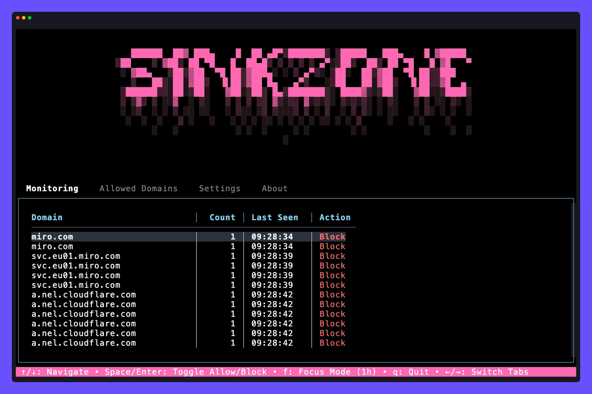

<a id="readme-top"></a>
---

<div align="center">
  
  <h1 align="center">Sinkzone: DNS-based Productivity Tool</h1>
  <p align="center">
    Stay focused by blocking distractions at the DNS level.
    <br /><br />
    <a href="#what-is-sinkzone"><strong>Learn More »</strong></a>
    &middot;
    <a href="#quick-start">Quick Start</a>
    &middot;
    <a href="https://github.com/berbyte/sinkzone/issues/new">Report a Bug</a>
    &middot;
    <a href="#usage">Usage Guide</a>
  </p>

  <p align="center">
    <a href="https://golang.org"></a>
    <a href="LICENSE"></a>
    <a href="https://github.com/berbyte/sinkzone/releases"></a>
  </p>
  
</div>

---

<details>
<summary><b>📚 Table of Contents</b></summary>


- [](#)
- [What is Sinkzone?](#what-is-sinkzone)
- [Motivation](#motivation)
- [Key Features](#key-features)
- [Quick Start](#quick-start)
  - [Docker](#docker)
  - [Configure System DNS (Required)](#configure-system-dns-required)
  - [Alternative Installation Methods](#alternative-installation-methods)
- [Demos](#demos)
  - [Command Line Interface (CLI)](#command-line-interface-cli)
  - [Terminal User Interface (TUI)](#terminal-user-interface-tui)
- [Documentation](#documentation)
  - [Manual Page](#manual-page)
- [Usage](#usage)
  - [Common Commands](#common-commands)
  - [TUI Navigation](#tui-navigation)
- [How It Works](#how-it-works)
  - [Architecture](#architecture)
  - [Normal Mode](#normal-mode)
  - [Focus Mode](#focus-mode)
- [Configuration](#configuration)
- [Development](#development)
- [License](#license)
- [Contact](#contact)

</details>


---
## What is Sinkzone?

Sinkzone is a local DNS resolver that helps you eliminate distractions and get deep work done. It blocks all domains by default — only the ones you explicitly allow can get through. This means notifications, social media, news, and other time-sinks are unreachable at the network level — not just in your browser.

It features a modern HTTP API, wildcard pattern support, and a beautiful terminal UI for real-time monitoring and control.

It's lightweight, cross-platform, and built for hackers, makers, and anyone serious about focus.

## Motivation

Most tools make you list what you want to block. But the internet is infinite — that list never ends. It's much easier to list the few things you actually want to allow.

Sinkzone was born from that insight. I was tired of coding sessions interrupted by Slack pings and email alerts. I needed something stronger than a browser plugin — a system-level kill switch for distractions.

Now I can code for hours uninterrupted. Even my son uses Sinkzone during chess practice to stay focused.

**Sinkzone exists because I needed it. Maybe you do too.**



*The Sinkzone Terminal User Interface showing real-time DNS monitoring and allowlist management*

---

## Key Features

- **DNS-level blocking**: Stops distractions before they reach your apps
- **Focus Mode**: Block all but allowlisted domains for a set duration
- **Wildcard Support**: Use patterns like `*github*` or `*.google.com` for flexible domain matching
- **HTTP API**: RESTful API for monitoring and control
- **Terminal UI**: Real-time DNS traffic viewer with tabbed interface
- **Memory-backed rules**: Focus mode expires automatically
- **Cross-platform**: Works on macOS and Linux

---

## Quick Start

### Docker

The easiest way to run Sinkzone on any platform:

```bash
# Pull and run the latest image
docker run -d \
  --name sinkzone \
  -p 53:5353/udp \
  --restart unless-stopped \
  -v ~/.sinkzone:/app/.sinkzone \
  ghcr.io/berbyte/sinkzone:latest resolver --port 5353
```

**That's it!** Sinkzone is now running and blocking distractions at the DNS level.

**Note:** Docker images are available for both Intel and Apple Silicon architectures and will be automatically selected based on your platform.

**Security:** The Docker container runs as a non-root user and binds to an unprivileged port (5353) internally, which is then exposed as port 53 on the host. This eliminates the need for root privileges while maintaining the same functionality.

**Next steps:**
```bash
# Check status
docker exec sinkzone status

# View DNS requests
docker exec sinkzone monitor

# Add github.com
docker exec sinkzone allowlist add github.com

# Enable focus mode
docker exec sinkzone focus start

# View logs
docker logs -f sinkzone

# Run any other sinkzone command
docker exec sinkzone --help
```

### Configure System DNS (Required)

**Important:** You must configure your system to use Sinkzone as the DNS resolver for it to work.

**macOS:**
```bash
sudo networksetup -setdnsservers "Wi-Fi" 127.0.0.1
```

**Linux:**
```bash
echo "nameserver 127.0.0.1" | sudo tee /etc/resolv.conf
```

**Windows:**
- Open Network & Internet settings
- Change adapter options
- Right-click your network adapter → Properties
- Select "Internet Protocol Version 4 (TCP/IPv4)" → Properties
- Select "Use the following DNS server addresses"
- Enter `127.0.0.1` as the preferred DNS server

### Alternative Installation Methods

<details>
<summary><b>📦 Package Managers</b></summary>

**Homebrew (macOS):**
```bash
brew tap berbyte/ber
brew install berbyte/ber/sinkzone
```

**Manual Setup:**
```bash
# 1. Start the DNS Resolver (default port 53, requires root)
sudo sinkzone resolver

# Or use an unprivileged port (no root required)
sinkzone resolver --port 5353

# 2. Launch the UI (in another terminal)
sinkzone tui

# 3. Enable Focus Mode
sinkzone focus start
```

</details>

<details>
<summary><b>🔨 Build from Source</b></summary>

```bash
# Clone and build
git clone https://github.com/berbyte/sinkzone.git
cd sinkzone
go build -o sinkzone .

# Follow the manual setup steps above
```

</details>

<details>
<summary><b>📥 Direct Download</b></summary>

Download the appropriate binary for your platform:

**macOS:**
```bash
# Apple Silicon (M1/M2)
curl -L -o sinkzone https://github.com/berbyte/sinkzone/releases/latest/download/sinkzone-darwin-arm64
chmod +x sinkzone
sudo mv sinkzone /usr/local/bin/

# Intel Mac
curl -L -o sinkzone https://github.com/berbyte/sinkzone/releases/latest/download/sinkzone-darwin-amd64
chmod +x sinkzone
sudo mv sinkzone /usr/local/bin/
```

**Linux:**
```bash
# AMD64
curl -L -o sinkzone https://github.com/berbyte/sinkzone/releases/latest/download/sinkzone-linux-amd64
chmod +x sinkzone
sudo mv sinkzone /usr/local/bin/

# ARM64
curl -L -o sinkzone https://github.com/berbyte/sinkzone/releases/latest/download/sinkzone-linux-arm64
chmod +x sinkzone
sudo mv sinkzone /usr/local/bin/
```

</details>

---

## Demos

### Command Line Interface (CLI)

The CLI offers powerful command-line tools for system management:


*Command-line allowlist management, focus mode control, and system status monitoring*

### Terminal User Interface (TUI)

The TUI provides real-time DNS monitoring and allowlist management:


*Real-time DNS traffic monitoring, allowlist management, and focus mode control*

---

## Documentation

### Manual Page

For detailed documentation, run:
```bash
sinkzone man
```

---

## Usage

### Common Commands

| Command                  | Description                    |
| ------------------------ | ------------------------------ |
| `sinkzone monitor`       | Show last 20 DNS requests      |
| `sinkzone tui`           | Launch the terminal UI         |
| `sudo sinkzone resolver` | Start DNS resolver on port 53  |
| `sinkzone focus start`   | Enable focus mode for 1 hour   |
| `sinkzone focus --disable` | Disable focus mode immediately |
| `sinkzone status`        | View current focus mode state  |
| `sinkzone allowlist add <domain>` | Add domain to allowlist |
| `sinkzone allowlist add "*github*"` | Add wildcard pattern |
| `sinkzone allowlist remove <domain>` | Remove domain from allowlist |
| `sinkzone allowlist list` | List all allowed domains |
| `sinkzone config set resolver <ip>` | Set resolver IP |
| `sinkzone man` | Show manual page |

### Wildcard Patterns

Sinkzone supports wildcard patterns for flexible domain matching:

| Pattern | Matches | Examples |
|---------|---------|----------|
| `*github*` | Any domain containing "github" | `github.com`, `api.github.com`, `githubusercontent.com` |
| `*.google.com` | All subdomains of google.com | `maps.google.com`, `drive.google.com`, `docs.google.com` |
| `api.*.com` | Any api subdomain of .com domains | `api.github.com`, `api.example.com`, `api.stackoverflow.com` |
| `exact.com` | Exact domain match only | `exact.com` (not `sub.exact.com`) |

**Examples:**
```bash
# Allow all GitHub-related domains
sinkzone allowlist add "*github*"

# Allow all Google subdomains
sinkzone allowlist add "*.google.com"

# Allow all API subdomains
sinkzone allowlist add "api.*.com"

# Allow exact domain
sinkzone allowlist add "stackoverflow.com"
```

### TUI Navigation

* `←`/`→`: Switch tabs
* `f`: Enable focus mode (1 hour)
* `q`: Quit
* Tabs include:

  * **Monitor**: Real-time DNS traffic
  * **Allowlist**: Add or remove allowed domains
  * **Settings**: DNS resolver config


## How It Works

### Architecture

Sinkzone is composed of three parts:

* **Resolver**: A local DNS server that intercepts queries and maintains real-time data via HTTP API.
* **HTTP API Server**: Provides REST endpoints for monitoring DNS queries and controlling focus mode.
* **TUI/CLI**: User interfaces that communicate with the resolver via HTTP API.
* **TUI**: A terminal UI for interacting with and monitoring the system via HTTP API.

### API Endpoints

The resolver exposes the following HTTP endpoints:

- `GET /api/queries` - Get the last 100 DNS queries
- `GET /api/focus` - Get current focus mode state
- `POST /api/focus` - Set focus mode (enabled/disabled, duration)
- `GET /api/state` - Get complete resolver state
- `GET /health` - Health check endpoint

**API Usage Examples:**
```bash
# Start resolver with custom API port
sudo sinkzone resolver --port 53 --api-port 8080

# Use CLI with custom API URL
sinkzone monitor --api-url http://localhost:8080
sinkzone focus --enable --api-url http://localhost:8080
sinkzone tui --api-url http://localhost:8080

# Direct API calls
curl http://localhost:8080/api/queries
curl http://localhost:8080/api/focus
curl -X POST http://localhost:8080/api/focus \
  -H "Content-Type: application/json" \
  -d '{"enabled": true, "duration": "1h"}'
```

### Normal Mode

* All DNS queries are forwarded to upstream resolvers
* You can view and manage DNS traffic and allowlist

### Focus Mode

* Only allowlisted domains resolve
* Everything else returns `NXDOMAIN`
* Automatically expires after specified duration
* Allowlist is reloaded when focus mode is enabled (changes take effect on new focus sessions)

---

## Configuration

Files are stored in `~/.sinkzone/`:

* `sinkzone.yaml`: Main config
* `allowlist.txt`: Simple text file containing allowed domains (supports wildcard patterns)
* `resolver.pid`: Process ID file for the DNS resolver

**Allowlist Format:**
```
# Comments start with #
github.com
stackoverflow.com
*github*
*.google.com
api.*.com
```

---

## Development

```bash
# Build binary
go build -o sinkzone .

# Run tests
go test ./...

# Run resolver with custom ports
sudo sinkzone resolver --port 5353 --api-port 8080

# Test API endpoints
curl http://localhost:8080/health
curl http://localhost:8080/api/queries

# Run TUI with custom API URL
sinkzone tui --api-url http://localhost:8080
```

**Architecture:**
- DNS Server: Handles DNS resolution and blocking
- HTTP API Server: Provides REST endpoints for monitoring and control
- CLI/TUI: User interfaces that communicate via HTTP API

PRs and issues welcome. We love contributors.

---

## License

MIT License. See the [LICENSE](LICENSE) file for full details.

---

## Contact

* Email: [dominis@ber.run](mailto:dominis@ber.run)
* GitHub: [github.com/berbyte/sinkzone](https://github.com/berbyte/sinkzone)

<p align="right">(<a href="#readme-top">back to top</a>)</p>
